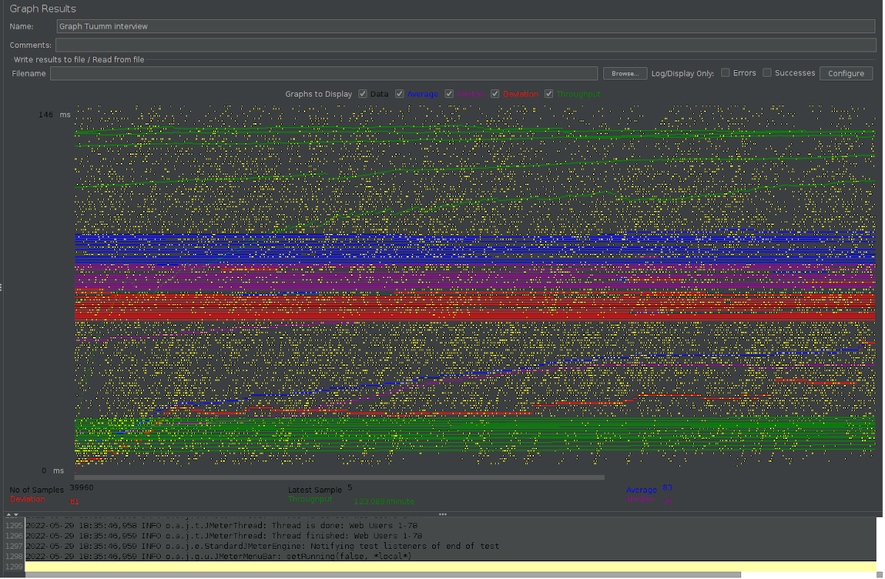

# Tuum test interview

### What you’ll need
+ Java 11
+ Docker installed and up running
+ Gradle to build the project

### Instructions on how to build and run applications
+ **On Unix**

```
$ gradle clean build
$ docker-compose up
```

### To run the application itself without docker-compose, add the follow lines to application.properties:
###### NB! the database and rabbitMq have to be up and running.
+ spring.rabbitmq.host=localhost
+ spring.rabbitmq.port=5672
+ spring.rabbitmq.username=guest
+ spring.rabbitmq.password=guest
+ spring.datasource.url=jdbc:postgresql://localhost:5432/tuum_db
+ spring.datasource.username=root
+ spring.datasource.password=root
+ spring.jpa.show-sql=true
+ spring.jpa.database=postgresql

### Location of initializer files

##### RabbitMQ
+ `tuum/init/` - in this directory contains all files needed to create the QUEUE used in the application.

```
tuum[root]
  |
  └── init
  |     └── definitions.json
  |     └── rabbitmq.conf
  └── src
```

##### Postgresql
+ `tuum/docker_postgres_init.sql` - The file contains all initial setup of database
```
tuum[root]
  |
  └── src
  └── docker_postgres_init.sql  
```
##### Docker compose
+ `tuum/docker-compose.yml` - The file has all services related to the task. They are:
  + The application itself 
  + postgres database
  + pgadmin
  + rabbitmq


### How to access the pgadmin

Try to run the following URL in the browser, http://localhost:16543, and enter username and password as:
+ **username** = test@gmail.com
+ **password** = test123!

After successful login, you will see the initial screen. Then click on the Connection tab to register. You can get Hostname by typing the following command:
```
$ ifconfig | grep inet
```

The database name is **tuum_db** and use **root** for username and password.

### How to access the rabbitMQ on browser

Type the address http://localhost:15672/ and use **guest** for username and password

### Explanation of the choices I made
+ To keep the simplicity, I chose to add one more field to request the Account creation to place the initial balance for the given currencies. It means that for the account creation that has more than one currency, all currencies will have the same value of balance.

+ To check if the customer has sufficient funds, I decided to create a trigger in database side to prevent concurrent transactions, what could end up with an inconsistent check funds method. 

For example:
```
          transaction 1     |     transaction 2
                            |
                            |
                            |
     check fund    ---------|
                            |
     start transaction------|
                            |
                            |----------- check fund
                            |
                            |
                            |------------ start transaction
     commit transaction-----|
                            |
                            |
                            |
                            |
                            |------------ commit transaction
```
+ Other than that, it was related to rabbitMq. I decided, in order to save time, leave as simple as possible. I could create a kind of a direct exchange and broadcast the message according key/messageType for direfferent queues, but it won't add too much value to the task, I believe.
+ Regarding the tests, where database is required I decided to use *testContainers*.

# Perform analyze
## Estimation of how many transactions per second the app can handle
###### Result got from apache jmeter 5.4
+ From my old buddy computer the app can handle approximately 2,051 requests per second or 123 per minute 



# What to consider to scale horizontally
+ A service-level agreement (SLA). How should be the system availability. How long time per year will be acceptable for the system to be down for maintenance.
+ Number of user/request per second. (peak time)
+ Users location. This will show how important or necessary it is to have a kind of CDN, content delivery network.
+ CAP theorem - to scale/sharding the database.
+ Metrics - Guide and identify if a process is good enough to meet the customer's requirements.
+ Skilled team - If you want to go fast, go alone but if you want to go further, go together
+ Budget

# Final notes
+ Lesson learned - First time I used *myBatis*. I had to learn how to use myBatis on the fly which ended up being more time-consuming than expected.
+ I am open to discuss about the test solution
+ Willing to have a feedback.
